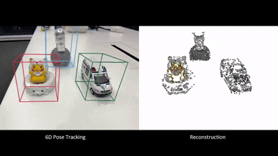
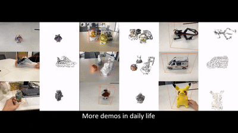

# Zero6DOT: Zero-shot 6D Object Pose Tracking with Monocular RGB Video
###  [Paper](https://ieeexplore.ieee.org/document/11028119) 
<br/>

> Zero6DOT: Zero-shot 6D Object Pose Tracking with Monocular RGB Video                                                                            
> Bo Pang, Deming Zhai, Jianan Zhen, Long Wang, Xu Han, Guofeng Zhang, Xianming Liu                             
> IEEE Transactions on Circuits and Systems for Video Technology (2025)





## Preparation
```shell
pip install -r requirement.txt
```
The environment is based on Ubuntu 23.04, Python 3.8, and PyTorch 1.13.1+cu117.

This project makes use of [SuperPoint](https://github.com/rpautrat/SuperPoint), [g2opy](https://github.com/uoip/g2opy), [co-tracker](https://github.com/facebookresearch/co-tracker) , and [SuperGlobal](https://github.com/ShihaoShao-GH/SuperGlobal). We sincerely thank the authors for their excellent work. Please refer to their official documentation for installation instructions.
Additionally, for g2opy, refer to this [issue](https://github.com/uoip/g2opy/issues/31) for guidance on modifying the code to set the camera intrinsics.


## Inference
Download the official dataset and extract it. Then, download our pretrained Co-Tracker model from [here](https://pan.baidu.com/s/1adtjj8vEomNvlxiDZ1J1WQ?pwd=igbt) and place it in the third_party/co-tracker directory.
We use  [Track-Anything](https://github.com/gaomingqi/Track-Anything)  to obtain the segmentation results. It uses SAM to generate the initial mask in the first frame and XMem for mask tracking. You can download our segmentation results from [here](https://pan.baidu.com/s/1_TdaB3yiaa8bXlcJGHyXcA?pwd=jfyk), and place them in the dataset folder.
> Note: The videos were segmented at a resolution of 640×480. We then apply simple linear interpolation to super-resolve the masks, and crop the objects from the original images accordingly.
Then put the segmention results in the dataset folder.

Finally, set the dataset path in the script and run the following command:
```shell
python test_onepose.py
```

## Render OmniObject3D and Train CoTracker
Follow the instructions in the obj-rendering directory to generate the rendered results of [OmniObject3D](https://omniobject3d.github.io/).
Then, refer to the code in cotracker-dataset and the official Co-Tracker repository to train the model.


## Citation
If you find this code useful for your research, please use the following BibTeX entry.

```bibtex
@ARTICLE{11028119,
  author={Pang, Bo and Zhai, Deming and Zhen, Jianan and Wang, Long and Han, Xu and Zhang, Guofeng and Liu, Xianming},
  journal={IEEE Transactions on Circuits and Systems for Video Technology}, 
  title={Zero6DOT: Zero-shot 6D Object Pose Tracking with Monocular RGB Video}, 
  year={2025},
  volume={},
  number={},
  pages={1-1},
  keywords={Solid modeling;Three-dimensional displays;Pose estimation;Data models;Accuracy;Training;Robustness;Point cloud compression;Annotations;Predictive models;6D Pose Tracking;Monocular RGB Video;Zero-shot},
  doi={10.1109/TCSVT.2025.3577617}}
```


